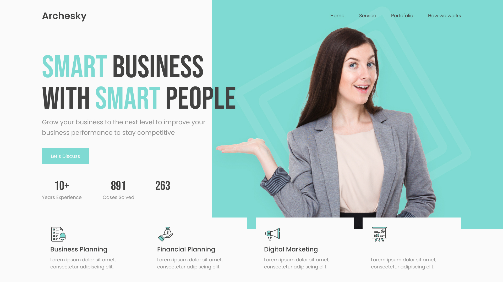

# Business Agency | Header 

## Project description 📄
En esta practica de proyecto practicaremos como se hace el maquetado de una pagina ver en sus diferentes versiones y estudiaremos como trabajar con git, github y sus difernetes herraminetas y comandos.

### TAREAS PENDIENTES
- [✔] Cambiar el favicon de la página por uno relacionado con la página.
- [✔] Hacer que el favicon se adapte tambien a una posible version oscura.
- [✔] Empezar proyecto por su versión mobile.
- [✔] Ir adaptando para disposito: tablet, desktop.
- [✔] Mejorar el header en una rama diferente para no modificar la rama principal de la página.
- [_] En Tablet hasta desktop, se debe cambiar el color del borde inferior a celeste al hacer scroll.
- [_] Se podría hacer alguna animación en el border.

### Dentro del hero
- [_] Buscar la manera en que la imagen del hero no se vea recoratada.
- [_] Optimizar la imagen principal del hero.

...

## Tools

